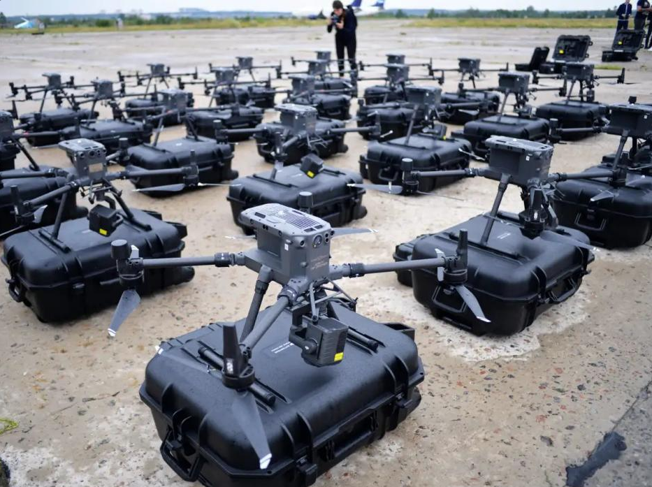

# Image Classification of Military Vehicles CNN

  
  

This project implements a Convolutional Neural Network (CNN) using PyTorch to classify images into three categories: tank, aircraft, and drone. It utilizes custom image datasets for training and testing, and applies several transformations to augment the data.

The model is trained on a dataset of labeled images and tested on a separate dataset. This README walks through the key components of the project.

## Setup

Before running the project, ensure that you have the required dependencies installed. Make sure you download the the correct Pytorch for your system:
    https://pytorch.org/

You can install the rest using pip:

    pip install matplotlib numpy

## Jumping Right In
### To review code and train a new cnn
    python main.py
### To run a pretrained cnn
    python run_trained_cnn.py

## Dataset

The project assumes that you have a dataset of images with corresponding labels. The dataset should be divided into two parts: a training set and a testing set. Each set should have an accompanying CSV file (train_csv.csv and test_csv.csv), which lists the image file paths and labels.

- Training images: ./data/train_data/
- Test images: ./data/test_data/

## Data Preprocessing

Data is preprocessed using the following transformations:

- Resize images to 256x256.
- Apply random horizontal flips and rotations.
- Normalize the pixel values.

These transformations help augment the dataset and improve generalization during training.
## Model Architecture

The model is a simple CNN built with PyTorch. It consists of three convolutional layers followed by batch normalization and pooling layers, along with fully connected layers at the end. Here's a summary of the layers:

- Conv Layers: 3 convolutional layers with 16, 32, and 64 filters, respectively.
- BatchNorm: Batch normalization after each convolution to stabilize training.
- Pooling: Max pooling after each convolutional block.
- Fully Connected: Three fully connected layers that map the flattened output to the final classification.

## Training, Testing, and Evaluating

The model is trained for 10 epochs using a CrossEntropyLoss function and the Adam optimizer. Training progress is logged at every 10 steps.

To start training:

    python main.py

### Training loop

- Loads data in batches of size 32.
- Runs forward pass, calculates loss, backpropagates, and updates the model.
- Outputs the loss every 10 steps.

### Testing
After training, the model is evaluated on the test dataset. The accuracy for each class (tank, aircraft, drone) is printed out at the end.

### Evaluation
Calculates the accuracy for each class based on the correct predictions.

Example output:

## Model Saving

After training, the model's parameters are saved to cnn_parameters.pth:

    torch.save(cnn.state_dict(), "cnn_parameters.pth")
